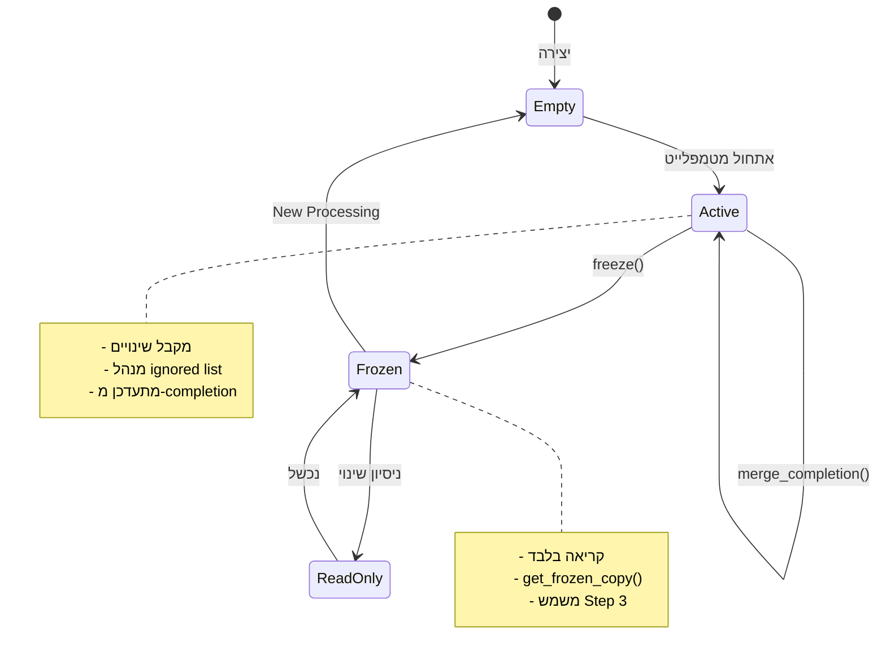
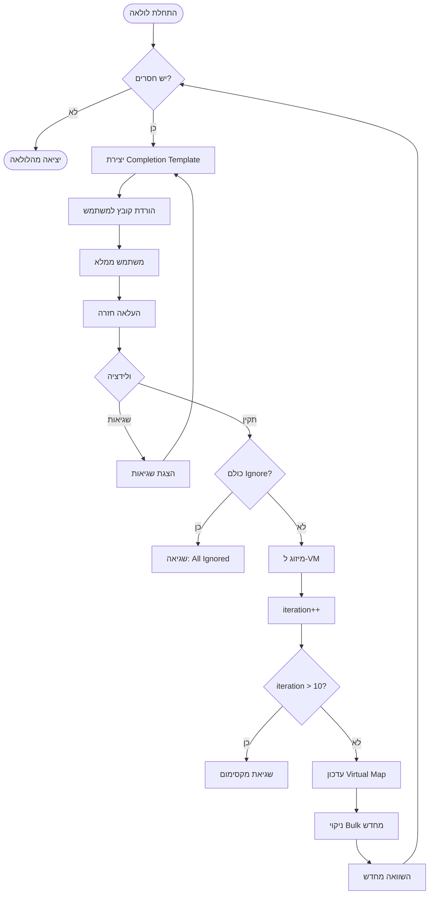
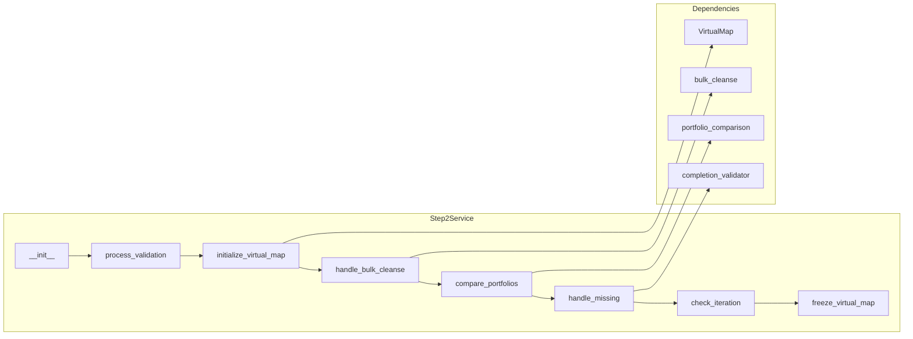
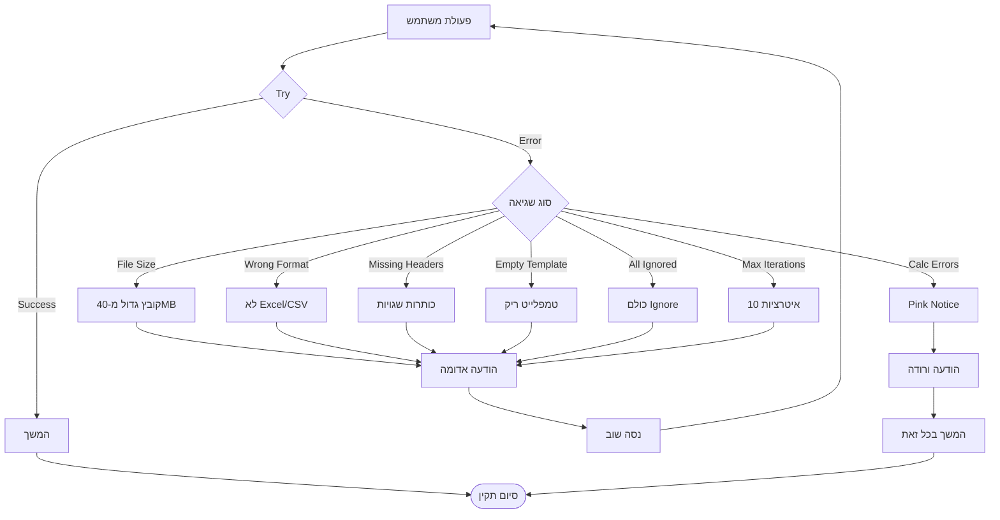
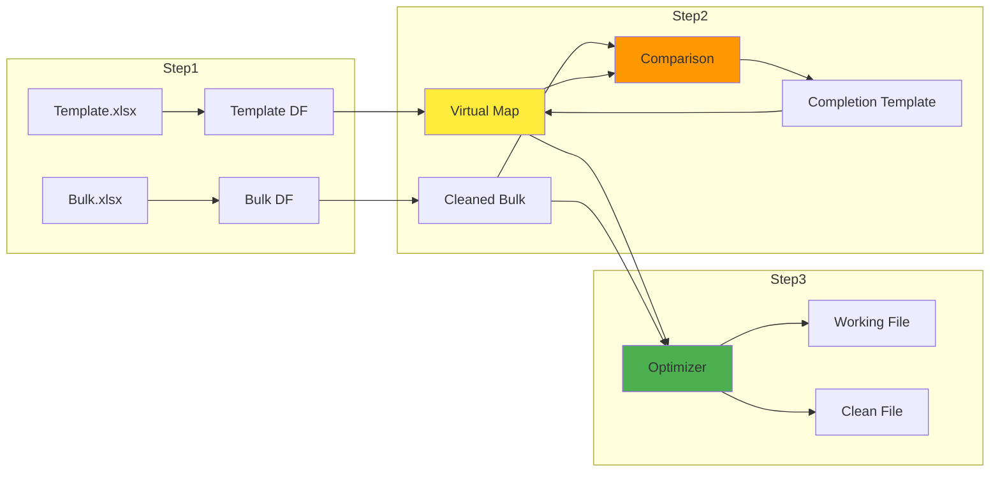
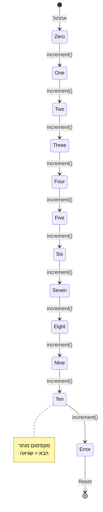

# תרשימי זרימה מעודכנים - Bid Optimizer Mockup

## תרשים זרימה ראשי - מבט על

```mermaid
flowchart TD
    Start([התחלה]) --> Upload[Step 1: Upload]
    
    Upload --> ValidateCheck{קבצים תקינים?}
    ValidateCheck -->|לא| UploadError[הודעת שגיאה]
    UploadError --> Upload
    ValidateCheck -->|כן| Validate[Step 2: Validate]
    
    Validate --> VMInit[אתחול Virtual Map]
    VMInit --> BulkClean[ניקוי Bulk]
    BulkClean --> Compare[השוואת פורטפוליוז]
    
    Compare --> Issues{יש בעיות?}
    Issues -->|לא| Freeze[VM.freeze()]
    Issues -->|חסרים| CompletionLoop[לולאת השלמה]
    Issues -->|עודפים| ShowExcess[הצגת עודפים]
    Issues -->|שניהם| BothHandle[טיפול בשניהם]
    
    CompletionLoop --> IterCheck{איטרציה < 10?}
    IterCheck -->|לא| MaxIterError[שגיאת מקסימום]
    IterCheck -->|כן| CompletionLoop
    
    CompletionLoop -->|הושלם| Freeze
    ShowExcess --> Freeze
    BothHandle --> CompletionLoop
    
    Freeze --> Output[Step 3: Output]
    Output --> CreateFiles[יצירת Working + Clean]
    CreateFiles --> Download[הורדת קבצים]
    
    Download --> Reset{New Processing?}
    Reset -->|כן| ClearAll[איפוס מלא]
    ClearAll --> Upload
    Reset -->|לא| End([סיום])
```

## Virtual Map State Machine



## Completion Template Loop - מפורט



## Step 2 Service - תזמור



## Error Handling Flow



## File Generation Pipeline

```mermaid
flowchart TB
    subgraph Input
        Bulk[Bulk DataFrame]
        VM[Virtual Map - Frozen]
        Opt[Selected Optimizations]
    end
    
    subgraph Processing
        Optimizer[ZeroSalesOptimizer]
        ChangeOp[Operation → Update]
        CreateSheets[Create Sheets]
    end
    
    subgraph Output Files
        Working[Working File<br/>2 sheets]
        Clean[Clean File<br/>1 sheet]
    end
    
    Bulk --> Optimizer
    VM --> Optimizer
    Opt --> Optimizer
    
    Optimizer --> ChangeOp
    ChangeOp --> CreateSheets
    
    CreateSheets --> Working
    CreateSheets --> Clean
    
    Working --> FileName1[Auto Optimized Bulk | Working | 2025-08-15 | 14-30.xlsx]
    Clean --> FileName2[Auto Optimized Bulk | Clean | 2025-08-15 | 14-30.xlsx]
```

## Reset Flow - New Processing

```mermaid
flowchart TD
    CurrentState[מצב נוכחי] --> ClickReset[לחיצה על New Processing]
    
    ClickReset --> ClearSession[ניקוי Session State]
    
    ClearSession --> Clear1[bulk_df = None]
    ClearSession --> Clear2[template_df = None]
    ClearSession --> Clear3[virtual_map = {}]
    ClearSession --> Clear4[iteration_count = 0]
    ClearSession --> Clear5[output_files = None]
    ClearSession --> Clear6[current_step = 1]
    
    Clear1 --> RedirectUpload[הפניה ל-Upload]
    Clear2 --> RedirectUpload
    Clear3 --> RedirectUpload
    Clear4 --> RedirectUpload
    Clear5 --> RedirectUpload
    Clear6 --> RedirectUpload
    
    RedirectUpload --> FreshStart[התחלה נקייה]
```

## Data Flow Through System



## Iteration Counter State

