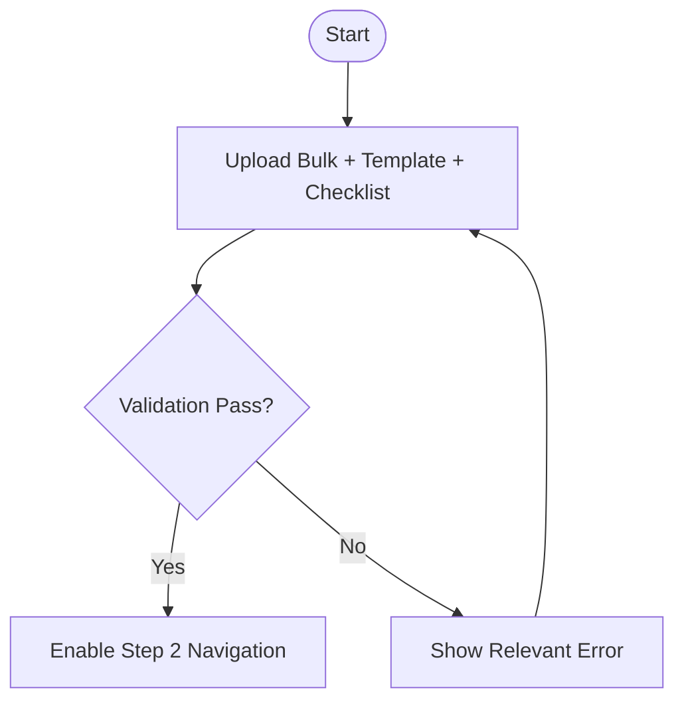
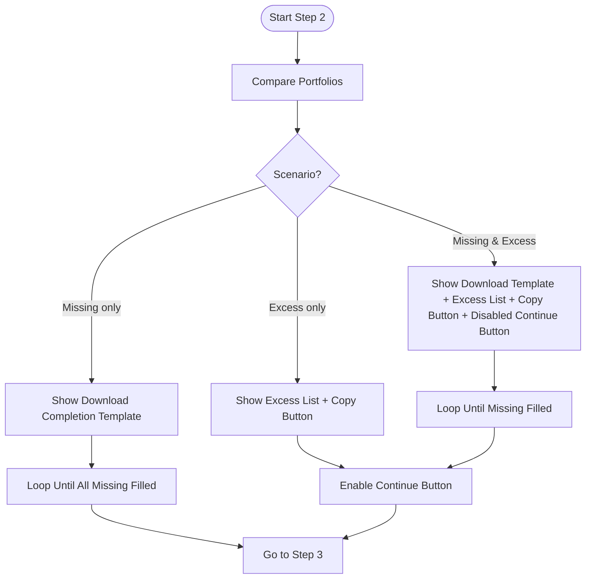
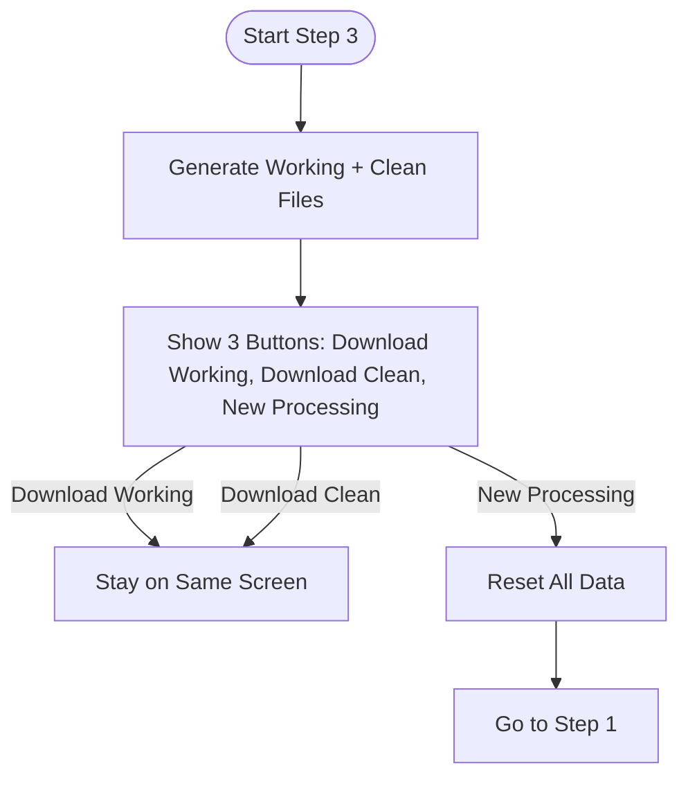
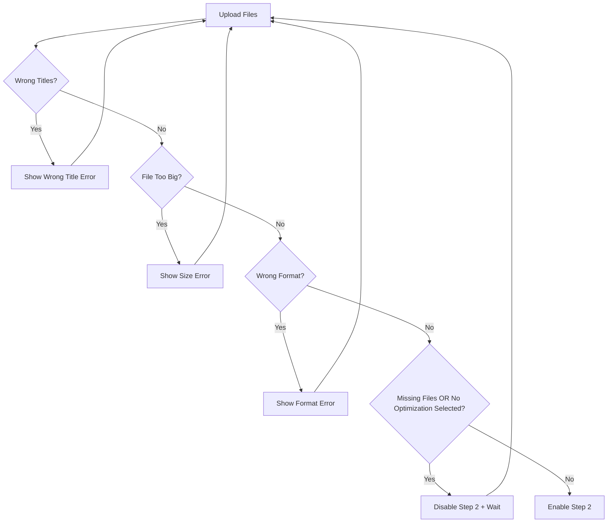
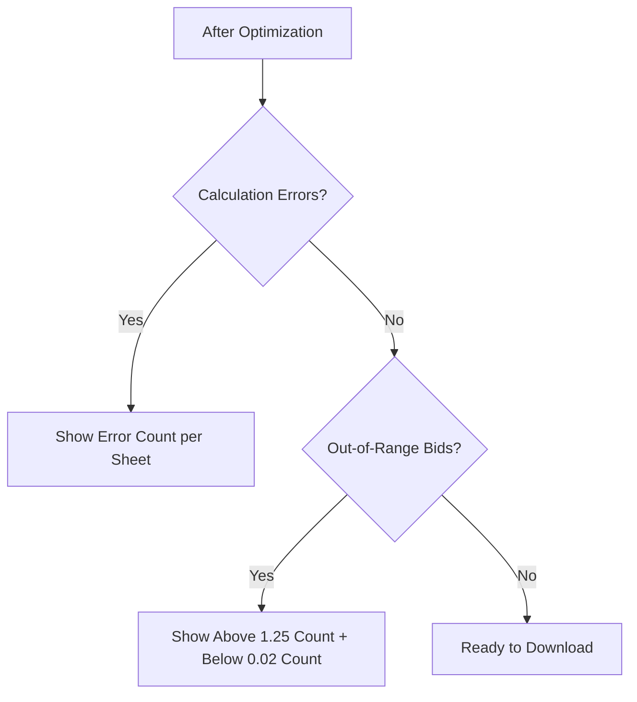
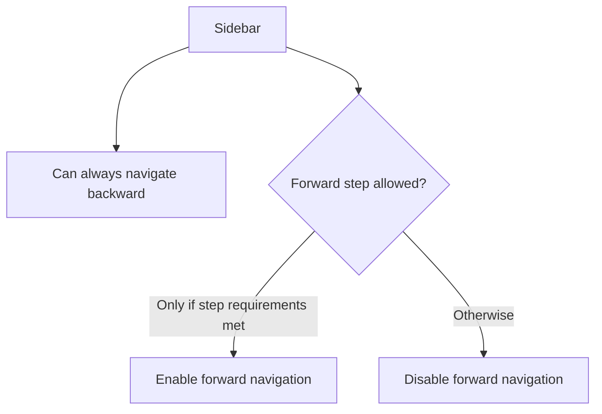

# Flowcharts – Mermaid Diagrams

המסמך מציג תרשימי זרימה גרפיים (Mermaid) לכל התרחישים: שלבים 1–3, ולתרחישי השגיאה/הודעות.

> הערה: התרשימים מתיישרים לדרישות ה־UI המעודכן עם סרגל צד, מעבר אחורה תמידי, ומעבר קדימה רק לאחר עמידה בדרישות השלב.

---

## Step 1 – Upload (Main Flow)



## Step 2 – Validate Portfolios (Main Flow)



## Step 3 – Optimization & Output (Main Flow)



---

## Step 1 – Error Flow



## Step 2 – Error Flow

```mermaid
flowchart TD
  V1[Upload Template]
  V1 --> A2{Wrong Titles?}
  A2 -- Yes --> X1[Show Titles Error]
  X1 --> V1
  A2 -- No --> B2{Empty Template?}
  B2 -- Yes --> X2[Show Empty Template Error]
  X2 --> V1
  B2 -- No --> C2{All Ignore?}
  C2 -- Yes --> X3[Show All Ignore Error (Stop)]
  C2 -- No --> D2{Wrong Format?}
  D2 -- Yes --> X4[Show Format Error]
  X4 --> V1
  D2 -- No --> E2[Proceed per Scenario]
```

## Step 3 – Info Messages Flow (Non-Blocking)



---

## Sidebar Navigation Logic (Global)



---

## Notes

* לחיצה על **New Processing** בשלב 3 מאפסת נתונים, מחזירה ל־Step 1, וחוסמת מעבר קדימה עד עמידה מחדש בדרישות.
* ב־Step 2, לחיצה על **Copy to Clipboard** לרשימת העודפים **אינה** משנה מסך ואינה מעבירה לשלב הבא.
* ב־Step 2, כפתור **Continue** קיים מיידית בתרחיש "עודפים בלבד", אך בתרחיש "חוסרים ועודפים" יופיע רק לאחר מילוי החוסרים.
