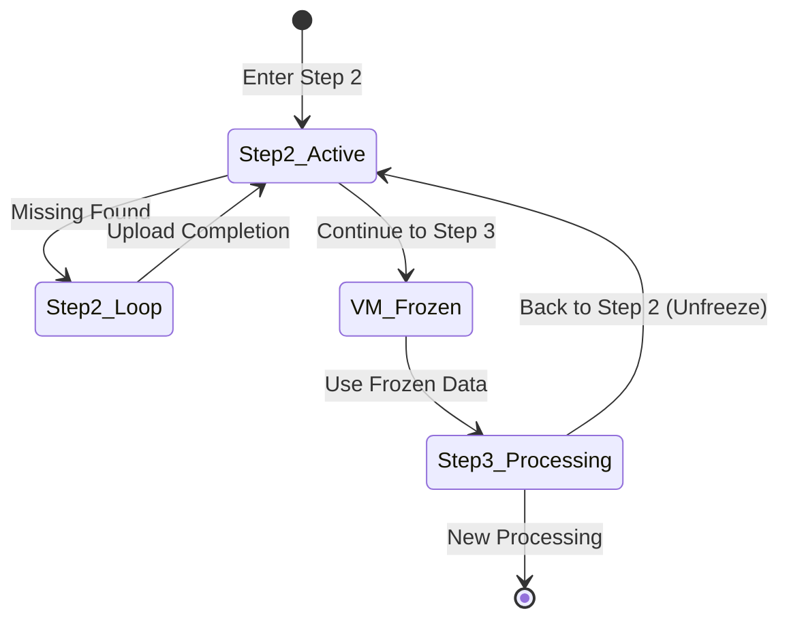

# אפיון Flowcharts מלא – Bid & Budget Optimizer

מסמך זה כולל את תרחישי הזרימה (Flowcharts), מצבי השגיאה, ותנאי המעבר בין שלבים, בהתאם לדרישות המוקאפ וה־UI החדש עם סרגל צד.

---

## מבנה ה־UI והמעבר בין שלבים

* **תנאי מעבר קדימה**:

  * **Step 1 → Step 2**: כל הקבצים הועלו, בפורמט נכון, עם הכותרות הנדרשות, ונבחר לפחות סוג אופטימיזציה אחד.
  * **Step 2 → Step 3**: כל החוסרים מולאו והועלה Template מלא, או שאין חוסרים (לפי התרחישים).
  * **Step 3 → Step 1**: רק דרך כפתור **New Processing**, שמאפס את כל הנתונים והמערכת שוכחת את ההרצה הקודמת.

---

## Flowcharts – תרחישים עיקריים

### שלב 1 – Upload

```
[Start]
  → [Upload Bulk + Template + Checklist]
  → (Validation Pass?) —Yes→ [Enable Step 2 Navigation]
                      —No→ [Show Relevant Error]
```

### שלב 2 – Validate Portfolios

```
[Start Step 2]
  → [Compare Portfolios]
  → IF חסרים בלבד:
       [Show Download Completion Template]
       [Loop Until All Missing Filled]
       → [Go to Step 3]
    IF עודפים בלבד:
       [Show Excess List + Copy Button]
       [Show Continue Button]
       → [Go to Step 3]
    IF חוסרים ועודפים:
        [Show Download Template + Excess List + Copy Button + Disabled Continue]
        [Loop Until Missing Filled]
        [Enable Continue Button]
        → [Go to Step 3]
```

### שלב 3 – Optimization & Output

```
[Start Step 3]
  → [Generate Working + Clean Files]
  [Show 3 Buttons: Download Working, Download Clean, New Processing]

IF Download Working OR Download Clean Clicked:
  [Stay on Same Screen]

IF New Processing Clicked:
  [Reset All Data]
  → [Go to Step 1]
```

---

## Virtual Map State Diagram



---

## מצבי שגיאה – לפי שלב

### Step 1 – Upload Errors

1. **כותרות לא נכונות**
   הודעה:

   ```
   [שם הקובץ]: wrong title – [שם הכותרת השגויה]
   ```
2. **גודל קובץ גדול מדי**

   ```
    [שם הקובץ] is too big, upload file less than 40MB   ```
3. **פורמט לא נתמך** (לא CSV או Excel)

   ```
   [שם הקובץ] is not CSV or Excel, please upload again
   ```
4. **חוסר קבצים או סוג אופטימיזציה**

   * הכפתור למעבר קדימה לא מופיע, וגם האפשרות ב־Sidebar חסומה.

---

### Step 2 – Validate Portfolios Errors

1. **כותרות לא נכונות בטמפלט**

   ```
   Please re-upload the file with the correct titles
   ```
2. **טמפלט ריק**

   ```
   Template is empty
   ```
3. **כל הפורטפוליוז מסומנים Ignore**

   ```
   All portfolios should be ignored, can't proceed
   ```
4. **פורמט לא נתמך** (לא CSV או Excel)

   ```
   Please re-upload Excel or CSV format files
   ```

*(הערה: לולאת החוסרים/עודפים אינה נחשבת "שגיאה" אלא תהליך רגיל)*

---

### Step 3 – Optimization & Output Messages

*(לא שגיאות, אלא הודעות אינפורמטיביות)*

1. **חישובים שגויים**

   ```
   X rows in [שם לשונית] contain calculation errors
   ```
2. **בידים חריגים**

   ```
   X rows in [שם לשונית] have bids above 1.25
   Y rows in [שם לשונית] have bids below 0.02
   ```

---

## תרשימי שגיאות – Flowcharts

### Step 1 – Error Flow

```
[Upload Files]
  → IF Wrong Titles → [Show Wrong Title Error] → [Retry Upload]
  → IF File Too Big → [Show Size Error] → [Retry Upload]
  → IF Wrong Format → [Show Format Error] → [Retry Upload]
  → IF Missing Files/No Optimization Selected → [Disable Step 2] → [Wait for Upload]
```

### Step 2 – Error Flow

```
[Upload Template]
  → IF Wrong Titles → [Show Titles Error] → [Retry Upload]
  → IF Empty Template → [Show Empty Template Error] → [Retry Upload]
  → IF All Ignore → [Show All Ignore Error] → [Stop]
  → IF Wrong Format → [Show Format Error] → [Retry Upload]
```

### Step 3 – Info Messages Flow

```
[After Optimization]
  → IF Calculation Errors → [Show Error Count per Sheet]
  → IF Out-of-Range Bids → [Show Above 1.25 Count] + [Show Below 0.02 Count]
```

---

## הערות יישום

* בכל שלב, חזרה אחורה אפשרית דרך הסרגל הצדדי.
* כפתור ה־"Continue" מופיע רק כאשר התנאים למעבר קדימה מולאו.
* כפתור **New Processing** בשלב 3 מאפס את המערכת לחלוטין ומחזיר ל־Step 1.